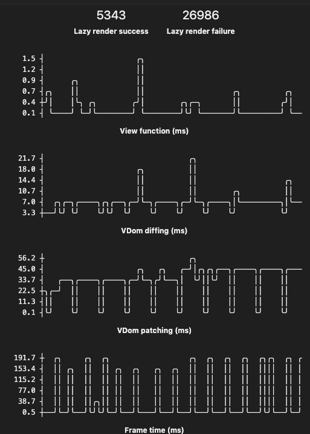

# Elm Performance Tools



## DISCLAIMER 
** EXPERIMENTAL, REQUIRES KERNEL CODE, MAY BEWITCH YOUR COMPUTER **

This library, requires changes to the `elm/browser` and `elm/virtual-dom` packages to add code to perform the benchmarks.

Running this code in your own project is possible, but requires unapproved methods that circumvent all of the guarantees you get with the Elm package system.

I do not recommend running this in production, it is intended for use in development environments to help with benchmarking and improving app performance.

## Trying it out

Open [antew.dev/lazy](https://antew.dev/lazy) and try it out.

## Usage in other projects

Because this requires modified kernel code you will need [shelm](https://github.com/robx/shelm) installed.

With shelm installed, edit the `elm.json` file in your project to point to the modified packages.

```
{
  ...
  "dependencies": {
    ...
    "locations": {
      "elm/virtual-dom": {
        "method": "git",
        "url": "https://github.com/antew/virtual-dom.git",
        "ref": "master"
      },
      "elm/browser": {
        "method": "git",
        "url": "https://github.com/antew/browser.git",
        "ref": "master"
      }
    }
  },
  ...
}
```

Next run `shelm fetch` to download the dependencies and get everything set up.

Once that is complete run your build, but substitute `shelm` for `elm`.  If you are using webpack with the node-elm-compiler, change the `pathToElm` to `shelm`:

```
{
  test: /\.elm$/,
  exclude: [/elm-stuff/, /node_modules/],
  loader: "elm-webpack-loader",
  options: {
    debug: false,
    optimize: true,
    pathToElm: "shelm"
  }
}
```

Final Steps:

- Disable debug mode, debug mode has additional overhead that would invalidate the data. This tool will not work in debug mode.
- Disabling `optimize` is optional, it'll work with either setting.
- Run your webpack build as usual.
- Go to [antew.dev](https://antew.dev) and drag the "Elm Performance Tools" bookmarklet to your bookmarks. (Github doesn't allow them in markdown)
- Open your app
- Click the bookmarklet
